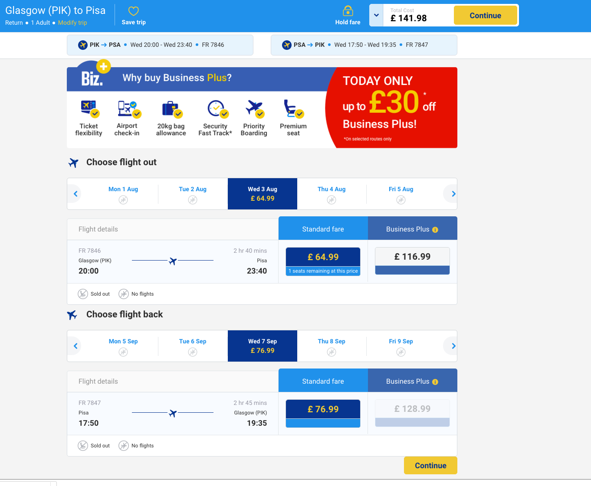
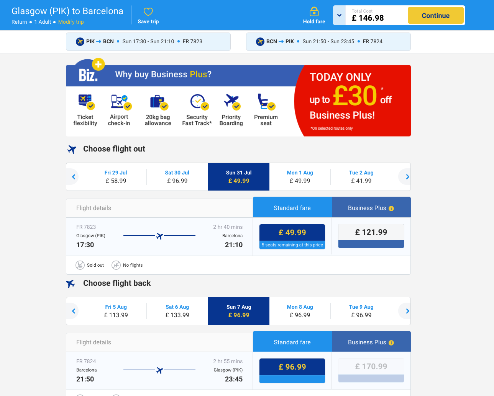

#Hello Hello! 

So I've put together some options for flights + villas.   

### What about Florence? 

It's not really a beach holiday but the area is amazing. We could visit Pisa, Florence and the rest of Tuscany from here. 

Ryanair fly directly to Pisa: 

And there are some awesome Villa's available around the area. 
- https://www.airbnb.com/rooms/11200668?guests=10&s=f1-QIYd0&check_in=2016-08-03&check_out=2016-08-10    
- https://www.airbnb.com/rooms/7123222?guests=10&s=liEdba_D&check_in=2016-08-03&check_out=2016-08-10    

### Barcelona 

Ryanair fly direct from Glasgow Prestwick.

The cheapest seems to be from Sunday 31st July to 7th Aug at around 140:

 

Some nice Villas around Barcelona.
Think it would be cool to chill outside and we can take a few day trips into Barcelona itself:

- https://www.airbnb.com/rooms/1490948?checkin=07%2F31%2F2016&checkout=08%2F07%2F2016&guests=10&s=6-5Jci1i
- https://www.tripadvisor.com/VacationRentalReview-g187497-d8011135-Can_Plana_de_Baix-Barcelona_Catalonia.html
- https://www.tripadvisor.com/VacationRentalReview-g1235431-d5805125-15096_Holiday_house_Barcelona-Castelltercol_Catalonia.html
- https://www.homeaway.co.uk/p6122297
- https://www.homeaway.co.uk/p1651934
   
###Mallorca
  
Flights are around the same price as Barcelona but Villas seem to be much nicer.

- https://www.homeaway.co.uk/p1659573 
- https://www.homeaway.co.uk/p1703968

